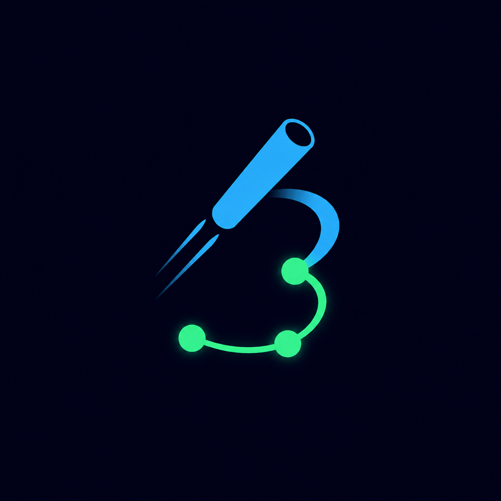

<p align="center">
  
</p>

# Baton

**A metadata-grounded codegen relay for DataHub.**

🔗 **Live demo:** **[baton.endpx.cloud](https://baton.endpx.cloud)** — no signup, no setup.

Open the [Studio](https://baton.endpx.cloud/studio) and press **Run**. It hits a real DataHub instance (827 entities from the `showcase-ecommerce` datapack): the Context agent searches the catalog, stops to ask which `orders` you meant, pulls the real columns, and the run ends with a validated dbt model and a `generated-by-baton` tag written back onto the source datasets. **▶ Demo** replays a recorded trace if you would rather not wait for a live run.

> The app is co-located with DataHub on its own host, because GMS is bound to localhost — a cloud-hosted frontend would have no route to the catalog it claims to read.

Baton is a multi-agent pipeline that turns a natural-language goal — *"generate a dbt model joining orders and customers, filtered to the last 90 days"* — into a validated, PR-ready dbt model, grounded in what your [DataHub](https://datahub.com) catalog actually knows: real schemas, real lineage, real ownership.

Like a relay race, three specialized agents each run their leg and pass a structured **baton** of context forward — and the last runner writes the result back into DataHub, so the next person (or agent) inherits the knowledge.

> 🏆 Built for [Build with DataHub: The Agent Hackathon](https://datahub.devpost.com/) — Track 1: *Agents That Do Real Work*.

## How it works

```
  goal ──▶ [ Context agent ] ──▶ [ Codegen agent ] ──▶ [ Publisher agent ] ──▶ dbt model + write-back
             resolves entities      generates SQL          packages .sql/.yml
             pulls schema &         validates against      writes provenance
             lineage via MCP        real schema (sqlglot)  back to DataHub
                                    self-corrects
```

1. **Context agent** — resolves the tables you mention into DataHub URNs via the DataHub MCP Server (`search`, `get_entities`), then pulls real column names/types and lineage (`list_schema_fields`, `get_lineage`, `get_lineage_paths_between`).
2. **Codegen agent** — generates a dbt SQL model constrained to the fetched schema, then validates every column reference with schema-aware [sqlglot](https://github.com/tobymao/sqlglot) qualification. Validation errors feed a bounded self-correction loop.
3. **Publisher agent** — packages the validated SQL into a dbt `.sql` model + `.yml` schema file, and writes provenance back to DataHub (tags/descriptions on the source tables), closing the loop in the metadata graph.

Every MCP tool call streams to a live trace UI, so you watch the baton move between agents in real time.

## Status

🚧 Under active development for the hackathon (deadline Aug 10, 2026).

## Self-hosting

Requirements: a DataHub instance (e.g. `datahub docker quickstart`) and an API key for any OpenAI-compatible LLM endpoint — the hosted demo runs `meta/llama-3.1-70b-instruct` on NVIDIA NIM, but OpenRouter, Together or a local vLLM work by changing `LLM_BASE_URL`.

```bash
# 1. DataHub, with the demo catalog
pip install acryl-datahub
datahub docker quickstart
datahub datapack load showcase-ecommerce      # ~827 entities

# 2. The SQL validator (sqlglot lives in Python, the orchestrator does not)
cd validator && python3 -m venv .venv && .venv/bin/pip install -r requirements.txt
.venv/bin/uvicorn app:app --host 127.0.0.1 --port 8100 &

# 3. Baton
cd ../web && npm ci
cp ../.env.example .env.local                 # fill in LLM_API_KEY + DATAHUB_GMS_TOKEN
npm run build && npm run start -- -p 3400
```

`uvx` must be on `PATH` — Baton spawns `uvx mcp-server-datahub@latest` as its
MCP sidecar, because GMS has no built-in `/mcp` endpoint on the open-source
build. Get the DataHub token from **Settings → Access Tokens**.

Run it on the same host as DataHub. GMS should stay bound to localhost, which
means a frontend hosted anywhere else cannot reach it.

## Sample output

[`examples/`](examples/) holds a dbt model Baton actually generated, with the
run that produced it written down — including why the column names in it are
the proof that grounding works.

## Tech

Next.js (TypeScript) · DataHub MCP Server · sqlglot · any OpenAI-compatible LLM · XyFlow (react-flow)

## Credits and disclosures

Baton was built during the hackathon submission period. Beyond the usual
frameworks and libraries, these pieces came from elsewhere:

- **shadcn/ui** (MIT) — the `badge`, `button` and `card` primitives in
  `web/src/components/ui/`, copied as that project intends.
- **Radial orbital timeline** — the animation in the landing page's *The relay*
  section began as a community-shared React component. It was restructured for
  Baton: React 19 ref semantics, a container-measured orbit radius, and the
  node data replaced with the pipeline's real stages and the tools each one
  calls.
- **DataHub** (Apache 2.0), **sqlglot** (MIT), **Next.js**, **XyFlow**,
  **Tailwind CSS**, **lucide** — used as dependencies.

Everything else — the three agent lanes, the graph rules, the stage palette,
the validation loop, the write-back, the trace UI — is original to this
submission.

## License

[Apache 2.0](LICENSE)
